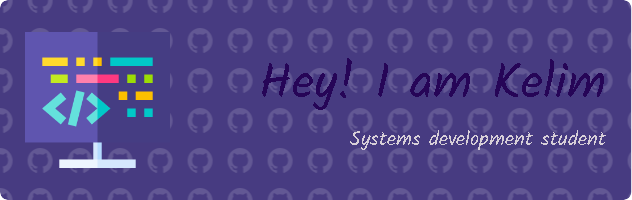

 

Future systems engineer with a passion for programming and web development. I aspire to become a versatile and efficient developer, capable of solving complex challenges with creativity and logic. I am open to collaborating on projects that help me grow professionally and contribute with my knowledge.

## Technology Stack 💻

 

 
  
  
  

  
 
  
    

## Stats 📈

  

  <!--  -->

<!-- ## Skills 🎯
- 🔭 I’m currently working on ...
- 🌱 I’m currently learning ...
- 👯 I’m looking to collaborate on ...
- 🤔 I’m looking for help with ...
- 💬 Ask me about ...
- 📫 How to reach me: ...
- 😄 Pronouns: ...
- ⚡ Fun fact: ... -->

